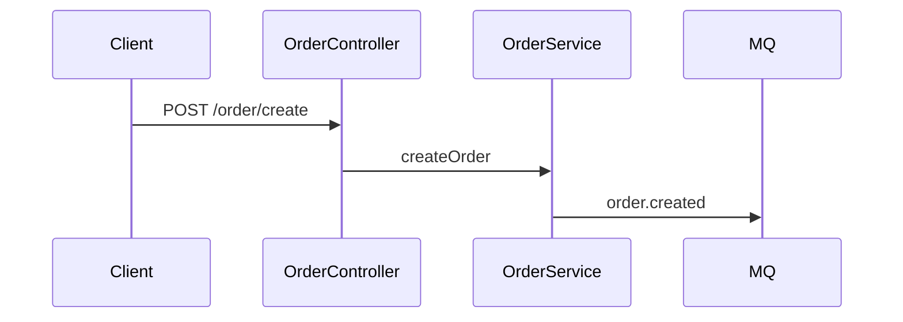

# 报告模板（4 份报告 + 总览）

所有报告头部统一：

```markdown
# <项目名> <报告名>

> 分析时间：YYYY-MM-DD HH:mm
> 分析方式：静态源码扫描（未编译、未运行项目）
> 技术栈：<Step 0 识别结果，如 Java 17 + Spring Boot 3.2 + MyBatis-Plus + MySQL 8>
```

结论必须标注来源（`path/file.java:42`）；推测性结论标注"（推测）"；密钥/密码打码。

---

## 模板 1：01-api-report.md（接口报告）

```markdown
# <项目名> 接口报告

<统一头部>

## 1. 概览

| 指标 | 数值 |
|------|------|
| 接口总数 | N |
| GET / POST / PUT / DELETE | N / N / N / N |
| 控制器/路由文件数 | N |
| 全局路由前缀 | 如 /api/v1（来源：application.yml:10） |

## 2. 全局路由配置

- context-path / 统一前缀：<值>（来源）
- API 版本策略：URL 版本 / Header 版本 / 无
- 鉴权框架：Spring Security / Sa-Token / JWT 过滤器 / 无（来源）

## 3. 接口清单（按模块分组）

### 3.1 <模块名，如 用户模块 user>（N 个接口）

| # | 方法 | 路径 | 处理函数 | 入参 | 出参 | 鉴权 | 来源 |
|---|------|------|----------|------|------|------|------|
| 1 | POST | /user/login | UserController.login | LoginDTO(username,password) | R<TokenVO> | 免鉴权 | UserController.java:35 |
| 2 | GET | /user/{id} | UserController.getById | id:Long | R<UserVO> | 需登录 | UserController.java:48 |

（每个模块一节。**接口默认全列**——用户拿报告就是为了查全量清单；仅当接口超 200 个时才截断并注明"完整 N 个，此处列前 200 个"。入参出参列可简写为模型名，不必展开字段）

## 4. 特别关注

### 4.1 无鉴权接口（疑似）
| 路径 | 来源 | 备注 |
|------|------|------|

### 4.2 废弃/注释掉的接口
### 4.3 路径冲突或重复注册
### 4.4 内部 RPC 接口（Feign/Dubbo/gRPC，如有）
```

---

## 模板 2：02-tech-report.md（技术报告）

```markdown
# <项目名> 技术报告

<统一头部>

## 1. 基础技术栈

| 项 | 值 | 来源 |
|----|----|------|
| 语言 | Java 17 | pom.xml:25 |
| 框架 | Spring Boot 3.2.1 | pom.xml:10 |
| 构建工具 | Maven 3.9（多模块 ×4） | pom.xml |
| 部署 | Dockerfile + docker-compose | 根目录 |

## 2. 依赖清单（业务相关）

| 类别 | 依赖 | 版本 | 用途 |
|------|------|------|------|
| ORM | mybatis-plus-boot-starter | 3.5.5 | 数据访问 |
| 缓存 | spring-boot-starter-data-redis | — | Redis 客户端 |

## 3. 中间件

| 中间件 | 用途 | 配置位置 | 证据 |
|--------|------|----------|------|
| Redis | 缓存 + 分布式锁 | application.yml:30 | RedisConfig.java:15 |
| RabbitMQ | 订单异步处理 | application.yml:45 | OrderConsumer.java:20 |

## 4. 第三方 API 集成

| 服务 | 类型 | SDK/方式 | 用途 | 配置（已打码） | 证据 |
|------|------|----------|------|----------------|------|
| 阿里云短信 | 短信 | dysmsapi20170525 | 登录验证码 | sms.access-key=LTAI**** | SmsService.java:22 |
| 微信支付 | 支付 | wechatpay-apiv3 | 订单支付 | pay.mch-id=16**** | PayConfig.java:18 |

## 5. 架构组件

| 组件 | 实现 | 说明 | 来源 |
|------|------|------|------|
| 拦截器 | JwtInterceptor | token 校验，放行 /login | JwtInterceptor.java:20 + WebConfig.java:30 |
| 全局异常 | GlobalExceptionHandler | @RestControllerAdvice，统一错误码 | GlobalExceptionHandler.java:12 |
| 跨域 | WebMvcConfigurer | 允许所有来源（⚠️） | WebConfig.java:25 |
| 统一响应 | R<T> | code/msg/data 信封 | R.java |
| 定时任务 | @Scheduled ×3 | 见 04 报告 | — |

## 6. 配置体系

| 配置文件 | 环境 | 关键配置 |
|----------|------|----------|
| application.yml | 公共 | 端口、日志 |
| application-dev.yml | 开发 | 本地 MySQL（账密已打码） |
| application-prod.yml | 生产 | Nacos 配置中心 |

## 7. 安全隐患

| 级别 | 问题 | 位置 | 建议 |
|------|------|------|------|
| 🔴 严重 | 数据库密码硬编码在 application-dev.yml | application-dev.yml:12 | 改环境变量/配置中心 |
| 🟡 中等 | MyBatis 使用 ${} 拼接 | UserMapper.xml:35 | 改 #{} 或白名单 |
| 🟢 低 | 跨域允许所有来源 | WebConfig.java:25 | 限定域名 |

## 8. 待确认依赖（用途不明）
```

---

## 模板 3：03-database-report.md（数据库报告）

```markdown
# <项目名> 数据库报告

<统一头部>

## 1. 数据库概况

| 项 | 值 | 来源 |
|----|----|------|
| 数据库类型 | MySQL 8 | application.yml:15 |
| 连接方式 | HikariCP + MyBatis-Plus | pom.xml |
| 库名 | xxx_db（账密已打码） | application.yml:15 |
| 迁移工具 | Flyway（12 个版本脚本） | db/migration/ |
| 缓存 | Redis（key 规范 xxx:xxx:%s） | RedisKeyConstant.java |

## 2. 数据表清单（N 张）

| # | 表名 | 说明 | 主键 | 索引数 | 来源 |
|---|------|------|------|--------|------|
| 1 | user | 用户表 | id | 3 | User.java:10 |
| 2 | order_info | 订单表（推测） | id | 5 | V3__order.sql |

## 3. 核心表结构（5-10 张）

### 3.1 user（用户表）

| 字段 | 类型 | 约束 | 说明 |
|------|------|------|------|
| id | BIGINT | PK, AUTO_INCREMENT | 主键 |
| phone | VARCHAR(11) | UNIQUE, NOT NULL | 手机号 |
| created_at | DATETIME | NOT NULL | 创建时间 |

来源：User.java:10-40 / V1__init.sql:5

## 4. 表关系

- order_info.user_id → user.id（逻辑外键，无物理约束，来源：Order.java:25）
- ...

## 5. 迁移 / SQL 文件

| 文件 | 内容 | 备注 |
|------|------|------|
| V1__init.sql | 初始化 8 张表 | — |
| V3__order.sql | 新增订单表 | 最近变更：git log |

## 6. 缓存设计（Redis）

| Key 模式 | 用途 | TTL | 来源 |
|----------|------|-----|------|
| user:info:{userId} | 用户信息缓存 | 30min | UserService.java:50 |
| login:code:{phone} | 短信验证码 | 5min | SmsService.java:40 |

## 7. 数据相关风险

- 实体与 SQL 不一致处
- 无索引的高频查询字段（推测）
- 大表/无分表迹象（推测）
```

---

## 模板 4：04-business-report.md（业务逻辑报告）

```markdown
# <项目名> 业务逻辑报告

<统一头部>

## 1. 项目定位

一段话：这是什么系统、服务什么业务、给谁用（基于 README/包名/接口推断，无 README 时标注"推测"）。

## 2. 模块划分

| 模块 | 职责 | 入口 | 关键类/文件 | 接口数 |
|------|------|------|-------------|--------|
| user | 用户注册登录、信息管理 | UserController | UserService, UserMapper | 8 |
| order | 下单、支付、查询 | OrderController | OrderService, PayClient | 12 |

## 3. 核心业务流程

### 3.1 <流程名，如 用户下单流程>

1. `POST /order/create` → OrderController.create（OrderController.java:30）
2. OrderService.createOrder：校验库存（StockClient）→ 计算价格 → 落库（OrderMapper）
3. 发送 MQ 消息 order.created（OrderProducer.java:20）
4. StockConsumer 消费消息扣减库存（StockConsumer.java:35）

### 3.2 <流程名>
（每条链路 4-8 步，关键步骤带来源）

### 流程图（可选，复杂项目）


## 4. 定时 / 异步任务

| 任务 | 触发方式 | 内容 | 来源 |
|------|----------|------|------|
| 订单超时关闭 | @Scheduled(cron="0 0/5 * * * ?") | 关闭 30 分钟未支付订单 | OrderTask.java:15 |
| MQ 消费者 ×2 | @RabbitListener | 库存扣减、积分发放 | — |

## 5. 对外集成点

| 方向 | 对象 | 方式 | 内容 | 来源 |
|------|------|------|------|------|
| 调用 | 微信支付的 | HTTPS SDK | 下单/查询/回调 | PayClient.java |
| 被调 | 前端小程序 | REST API | 全部业务接口 | — |
| 被调 | 微信支付回调 | POST /pay/notify | 支付结果通知 | PayController.java:60 |

## 6. 模块依赖关系

- order → user（查用户信息）、stock（库存）、pay（支付）
- 文字描述或简单列表即可

## 7. 遗留风险与重构建议（推测项标注）

| 问题 | 位置 | 建议 |
|------|------|------|
| Service 层 500+ 行巨型类 | OrderService.java | 按职责拆分 |
| 业务逻辑写在 Controller | XxxController.java:40 | 下沉到 Service |
```

---

## 模板 5：00-overview.md（总览）

```markdown
# <项目名> 后端分析总览

> 分析时间：YYYY-MM-DD HH:mm
> 分析方式：静态源码扫描

## 项目画像

一段话：技术栈 + 业务定位 + 规模 + 架构形态（单体/微服务）。

## 规模统计

| 指标 | 数值 |
|------|------|
| 源文件数 | N（Java N / SQL N / 配置 N） |
| 接口数 | N |
| 数据表 | N |
| 业务依赖 | N |
| 中间件 | N |
| 第三方 API | N |

## 报告索引

| 报告 | 摘要 | 链接 |
|------|------|------|
| 接口报告 | N 个接口，M 个疑似无鉴权 | 01-api-report.md |
| 技术报告 | 中间件 N / 第三方 API N / 安全隐患 N（🔴x 🟡y） | 02-tech-report.md |
| 数据库报告 | N 张表，核心表 M 张 | 03-database-report.md |
| 业务报告 | N 个模块，M 条核心流程 | 04-business-report.md |

## Top 风险 / 遗留点

1. 🔴 <最严重的一条，带来源>
2. 🟡 <第二条>
3. ...

## 建议阅读顺序（接手人）

1. 本总览 → 2. 业务报告（理解做什么）→ 3. 接口报告（理解对外契约）→ 4. 数据库报告（理解数据）→ 5. 技术报告（理解实现细节）
```
