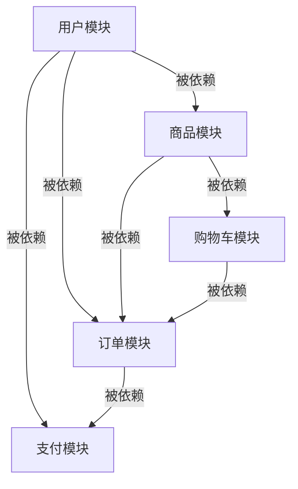

# 业务模块拆分与依赖拓扑

> 超大项目（1000+ 页面）迁移的核心前提：将项目按业务模块合理拆分，明确模块间依赖关系，确定迁移优先级。

## 一、模块识别方法

### 1.1 从 pages.json 自动提取

```javascript
// 解析 pages.json 获取模块结构
const pagesJson = require('./src/pages.json')

function extractModules(pagesJson) {
  const modules = []

  // 1. 主包页面
  const mainPages = (pagesJson.pages || []).map(p => p.path)
  if (mainPages.length > 0) {
    modules.push({ name: '主包', pages: mainPages, isSubPackage: false })
  }

  // 2. 分包页面
  const subPackages = pagesJson.subPackages || pagesJson.subpackages || []
  subPackages.forEach(sub => {
    modules.push({
      name: sub.root.replace('pages/', '').replace('pages\\/', ''),
      root: sub.root,
      pages: sub.pages.map(p => sub.root + '/' + p.path),
      isSubPackage: true
    })
  })

  return modules
}
```

### 1.2 从目录结构推断

```
src/
├── pages/
│   ├── user/          → 用户模块
│   │   ├── login/
│   │   ├── register/
│   │   ├── profile/
│   │   └── settings/
│   ├── goods/         → 商品模块
│   │   ├── list/
│   │   ├── detail/
│   │   └── search/
│   ├── order/         → 订单模块
│   │   ├── list/
│   │   ├── detail/
│   │   └── confirm/
│   └── payment/       → 支付模块
│       ├── index/
│       └── result/
├── store/
│   └── modules/
│       ├── user.js    → 用户模块的 store
│       ├── goods.js   → 商品模块的 store
│       ├── order.js   → 订单模块的 store
│       └── cart.js    → 购物车模块的 store
└── components/
    ├── UserCard/      → 用户模块的组件
    ├── GoodsItem/     → 商品模块的组件
    └── OrderStatus/   → 订单模块的组件
```

**映射规则**：

```
pages/<name>/  → <name> 模块
store/modules/<name>.js → <name> 模块的 Store
components/<NameXxx>/ → 按组件用途归入对应模块
```

### 1.3 人工确认模块边界

自动识别后需人工确认：
- 是否有页面归属多个模块（拆分不清晰）→ 重新划分
- 是否存在不属于任何模块的"杂项页面"→ 归入"公共/基础设施"
- 模块命名是否符合业务语义 → 调整为业务语言

---

## 二、模块依赖分析

### 2.1 依赖维度

| 维度 | 检测方法 | 说明 |
|------|----------|------|
| Store 依赖 | 页面中 `import store from` / `this.$store.dispatch('moduleName/')` | 页面使用了哪些 Vuex 模块 |
| 组件依赖 | 页面中 `import Xxx from '@/components/'` | 页面引用了哪些公共组件 |
| Mixin 依赖 | 页面中 `mixins: [xxx]` | 页面使用了哪些 mixin |
| API 依赖 | 页面中 API 调用 | 页面调用了哪些后端接口 |
| 路由跳转 | `uni.navigateTo({ url: '/pages/xxx' })` | 页面跳转关系 |

### 2.2 生成依赖拓扑图



**解释**：
- 用户模块被 3 个模块依赖 → 高被依赖、低对外依赖 → **P0 最先迁移**
- 商品模块被 2 个模块依赖 → **P1**
- 购物车模块被 1 个模块依赖 → **P2**
- 订单模块依赖 3 个模块 → **P3**
- 支付模块依赖 2 个模块 → **P4**

### 2.3 依赖矩阵模板

| 模块 | 用户 | 商品 | 购物车 | 订单 | 支付 | 被依赖次数 | 优先级 |
|------|------|------|--------|------|------|-----------|--------|
| 用户 | — | — | — | ✓ | ✓ | 3 | P0 |
| 商品 | ✓ | — | — | ✓ | — | 2 | P1 |
| 购物车 | ✓ | ✓ | — | ✓ | — | 1 | P2 |
| 订单 | ✓ | ✓ | ✓ | — | ✓ | 0 | P3 |
| 支付 | ✓ | — | — | ✓ | — | 0 | P4 |

---

## 三、迁移优先级计算

### 3.1 计算公式

```
模块优先级分值 = 被依赖次数 × 3 + (1 / 对外依赖次数) × 2 + (页面总数 - 页面数) × 0.1

被依赖次数: 其他模块依赖该模块的数量（越多越优先）
对外依赖次数: 该模块依赖其他模块的数量（越少越优先，+1 防止除零）
页面总数: 所有模块页面数之和
页面数: 该模块页面数（越少越优先）
```

### 3.2 优先级分组

| 分组 | 特征 | 策略 |
|------|------|------|
| **P0 基础模块** | 被依赖最多、对外依赖最少、页面最少 | 最先迁移，迁移后可被其他模块复用 |
| **P1 核心模块** | 被依赖较多、页面数适中 | 第二批迁移 |
| **P2 业务模块** | 被依赖较少、页面数较多 | 第三批迁移 |
| **P3 独立模块** | 几乎不被依赖、业务独立 | 最后迁移，风险最低 |

---

## 四、单模块迁移清单模板

```markdown
## 模块迁移清单：<模块名>

### 基本信息
- 模块名称: xxx
- 页面数量: x 个
- 组件数量: x 个
- Store 数量: x 个
- 优先级: Px
- 依赖模块: xxx
- 被依赖模块: xxx

### 迁移文件清单

#### Store（Vuex → Pinia）
- [ ] store/modules/xxx.js → stores/modules/xxx.ts

#### 组件（Options API → <script setup>）
- [ ] components/Xxx/index.vue
- [ ] components/Yyy/index.vue

#### 页面（Options API → <script setup>）
- [ ] pages/xxx/index.vue
- [ ] pages/xxx/detail.vue

#### Mixin（→ Composable）
- [ ] mixins/xxx.js → composables/useXxx.ts

### 验证
- [ ] 模块构建通过（npm run build:mp-weixin）
- [ ] 所有页面可正常打开
- [ ] 数据请求正常
- [ ] 页面交互正常
- [ ] Store 状态同步正常

### 灰度
- [ ] 开发环境验证
- [ ] 测试环境验证
- [ ] 预发环境验证
- [ ] 生产环境小流量灰度
- [ ] 生产环境全量
```

---

## 五、多团队并行策略

当有多个团队参与迁移时：

### 5.1 模块分配

```
团队 A: P0 基础模块（用户模块、公共组件）
  ↓ 完成后，其他团队的基础设施就绪

团队 B: P1 核心模块（商品模块、列表页组件）  
  ↓ 与团队 A 并行开始，但因为依赖团队 A 的公共组件，组件迁移需等 A 完成

团队 C: P2 业务模块（订单模块）
  ↓ 在团队 A 完成后开始，依赖用户模块和公共组件

团队 D: P3 独立模块（营销模块、活动模块）
  ↓ 几乎无依赖，可随时开始
```

### 5.2 分支策略

```
main (稳定，生产环境)
├── feature/upgrade-user-module      (团队 A)
├── feature/upgrade-goods-module     (团队 B)
├── feature/upgrade-order-module     (团队 C)
└── feature/upgrade-marketing-module (团队 D)

合并顺序：
  feature/upgrade-user-module → main
  ↓ (rebase)
  feature/upgrade-goods-module → main
  ↓
  feature/upgrade-order-module → main
  ↓
  feature/upgrade-marketing-module → main
```

### 5.3 冲突处理

- 公共组件变更 → 先合入 main，其他分支 rebase
- Store 变更 → 通过 Pinia Store 隔离，减少冲突
- pages.json 路由冲突 → 预分配页面路径段，避免重叠
